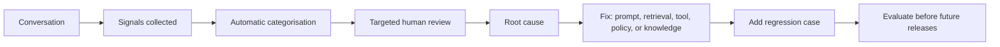

# AI Agent Feedback: Scaling Cheat Sheet

## Core idea

Treat AI quality as a **measurement and learning system**, not just a feedback widget. Combine user behaviour, automated evaluation, targeted human review, and regression tests so every important failure becomes harder to repeat.

## 1. Collect behavioural signals at scale

Behaviour is often more plentiful and less biased than explicit ratings. Instrument signals such as:

| Signal | Possible interpretation |
| --- | --- |
| Immediate rephrase of the same question | The answer was unclear or missed the intent. |
| Multiple retries | Low confidence or unsatisfactory answer. |
| User correction (for example, “That’s wrong”) | Likely accuracy, grounding, or understanding failure. |
| Heavy editing of generated content | Output was not usable as-is. |
| Copying or applying the result | Potential usefulness signal. |
| Task completion without retries | Potential success signal. |
| Human-support handoff | The agent could not resolve the task. |
| Abandonment | Ambiguous: may mean success or failure; interpret with context. |

### Conversation health score

Create a weighted score from several signals, rather than treating any one signal as definitive.

```text
Positive examples: task completed, no retry, no correction, no escalation
Negative examples: repeated reformulations, user says it is wrong, handoff to support
```

Use the score to prioritize review, detect regressions, and estimate quality across large volumes.

## 2. Use LLM-as-a-judge for structured evaluation

Run a separate evaluator over conversations or a representative sample. Have it return structured fields, not only a prose opinion.

Suggested dimensions:

- Intent match: did the answer address what the user meant?
- Groundedness/accuracy: is it supported by approved sources or tool results?
- Completeness: was essential information missing?
- Policy and safety: did it follow product rules and avoid harmful advice?
- Tone and clarity: was it appropriate and easy to act on?
- Root-cause hint: prompt, retrieval, tool, knowledge, policy, or other.

Example record:

```yaml
intent_match: 9
accuracy: 6
completeness: 7
severity: medium
failure_category: retrieval_failure
reason: "The response described a similarly named feature, not the requested one."
```

Calibrate the evaluator periodically against human ratings. Do not use it as the only source of truth, especially for high-risk decisions.

## 3. Focus human review where it matters

Avoid purely random transcript reading. Oversample conversations with:

- Low conversation-health or judge scores
- Thumbs-down ratings or corrective follow-ups
- Many retries, long delays, or tool errors
- Human handoffs
- New prompts, models, retrieval indexes, or product releases
- High-value customer segments
- High-risk domains, such as payments, legal, health, or security

Ask reviewers to label both **outcome quality** and **root cause**. Keep reviewer guidelines and examples consistent so labels remain reliable.

## 4. Build an offline evaluation dataset

Turn real, privacy-reviewed failures and important workflows into durable test cases.

Each case should include:

```text
User request
Relevant context / available tools or sources
Expected behavior
Must include
Must not include
Expected tool use (if applicable)
Risk level and failure category
```

Run this dataset automatically before shipping changes to prompts, models, tools, retrieval, policies, or knowledge. Add a regression case whenever you fix a meaningful issue.

## 5. Maintain a practical failure taxonomy

Use a small, actionable set of categories. Start with:

- Wrong answer
- Hallucination / unsupported claim
- Did not understand the question
- Missing important information
- Incorrect refusal or unsafe compliance
- Retrieval failure
- Tool failure or timeout
- Workflow / orchestration failure
- Too verbose, too short, unclear, or poor tone
- Slow response
- Other / needs investigation

Allow multiple labels when needed, but identify a primary category for reporting. Periodically refine the taxonomy when “other” becomes common.

## 6. Build a quality dashboard

Monitor trends over time, not isolated conversations.

Key metrics:

- Explicit satisfaction rate
- Estimated resolution / task-completion rate
- Conversation health score
- Retry and reformulation rate
- Human-handoff and escalation rate
- Judge scores by dimension
- Hallucination / groundedness estimate
- Retrieval miss and tool-failure rates
- Latency and cost

Slice every metric by product feature, prompt version, model version, language, user segment, country, release date, and risk tier. Alert on statistically meaningful regressions after releases.

## 7. Request contextual feedback, lightly

Keep thumbs up/down, then ask a short follow-up only when it is useful.

Examples:

- “Did this solve your problem?”
- “What was missing?”
- “Which part was incorrect?”
- “Was the answer too detailed, too brief, or unclear?”

Prefer multiple-choice responses for clean analysis, with an optional free-text field for nuance. Trigger questions contextually and sparingly to avoid feedback fatigue.

## 8. Close the learning loop



The non-negotiable step: **each material fix should create a regression test**. This converts one-off support work into compounding quality improvement.

## 9. Suggested maturity model

| Stage | What “good” looks like |
| --- | --- |
| 1. Manual foundation | Thumbs up/down, manual transcript review, and follow-up analysis. |
| 2. Instrumented quality | Behavioural signals, conversation health score, structured LLM evaluation, and targeted review. |
| 3. Release confidence | Curated evaluation dataset with real failures; automated pre-release regression testing. |
| 4. Continuous improvement | Dashboards, quality alerts by version/segment, and human attention focused on high-risk or significant changes. |

## Operating principles

1. No single signal proves quality; triangulate across behaviour, automated scores, and human judgment.
2. Measure outcomes and root causes separately.
3. Protect privacy: minimize retained data, redact sensitive content, control access, and define retention rules.
4. Evaluate high-risk workflows more strictly and with human oversight.
5. Version prompts, models, tools, and knowledge sources so quality changes are traceable.
6. Optimize for user task success, not merely engagement or conversation length.
